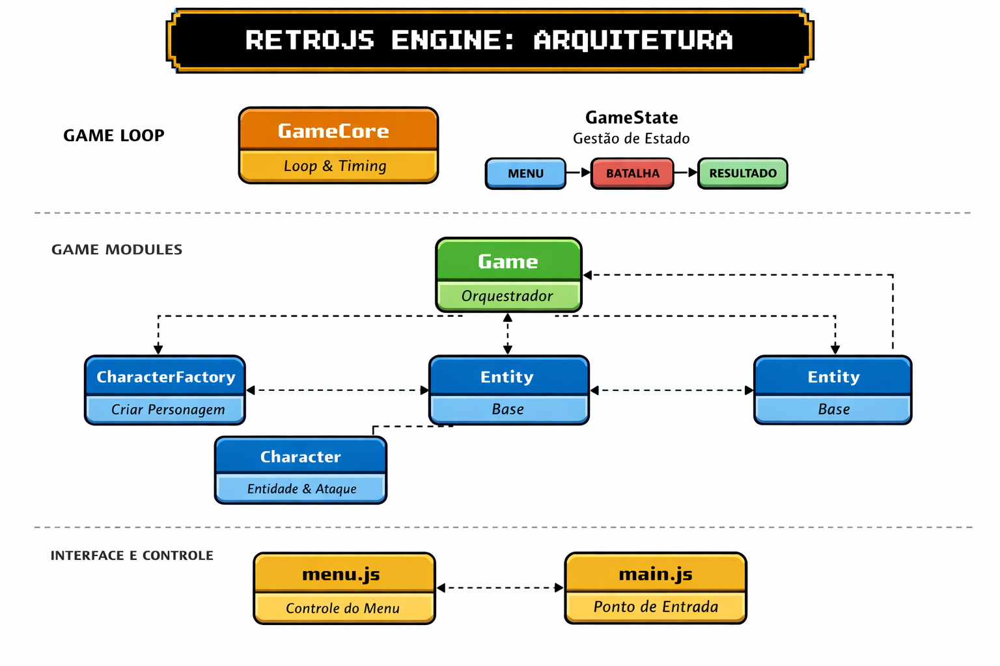

# 🎮 Mini Game RetroJS

Um **mini game retrô em JavaScript puro**, inspirado em RPGs clássicos do NES.

A RetroJS Engine foi projetada para rodar **100% no navegador**, sem dependências externas, utilizando **ES Modules**, arquitetura modular e padrões clássicos de game engines.


## ✨ Principais Características
- ⚙️ Engine modular
- 🧠 Gerenciamento de estados (MENU → BATALHA → RESULTADO)
- ⚔️ Sistema de combate por turnos
- 🧩 Sistema de personagens e ataques
- 🖥️ UI retrô estilo NES
- 📦 100% JavaScript moderno (ES Modules)


## 🗺️ Diagrama Arquitetural



## 📁 Estrutura do Projeto

```
/engine
 ├─ core.js        # Loop principal do jogo
 ├─ state.js       # Gerenciamento de estados
 ├─ entity.js      # Entidade base
 ├─ character.js   # Personagens jogáveis
 ├─ factory.js     # Factory de personagens
 ├─ ui.js          # Interface e HUD
 └─ game.js        # Orquestração do jogo

/menu.js           # Controle do menu
/style.css         # Estilo retrô NES
/index.html        # Entry point
```


## 🚀 Como Executar


> **Importante:** Por usar ES Modules, o projeto precisa ser executado via servidor.

Python

```bash
python -m http.server
```

Depois acesse:

```
http://localhost:3000
```


## 🕹️ Fluxo do Jogo

1. Menu inicial
2. Escolha do nome e classe
3. Início da batalha
4. Turnos de ataque
5. Exibição do resultado
6. Retorno ao Menu inicial

## 🛠️ Tecnologias Utilizadas

- JavaScript
- HTML5
- CSS3
- Web APIs nativas

## 🌐 Compatibilidade de Navegadores

| Navegador | Suporte          |
| --------- | ---------------- |
| Chrome    | ✅                |
| Firefox   | ✅                |
| Edge      | ✅                |
| Brave      | ✅                |
| Safari    | ⚠️ Parcial (ESM) |


## 📜 Licença

MIT License — livre para estudo, modificação e uso comercial.

## 👨‍💻 Desenvolvedor

Me chamo Lucas Santos, este projeto foi um desafio de um amigo de curso, desenvolvido inteiramente com hands-on e base lógica de programação com Javascript, Neste sentido torno publico e retutilizavel minhas linhas de código afim de contribuir e tornar a comunidade Dev maior e mais colaborativa.

Conecte-se comigo:       
[LinkedIn](https://www.linkedin.com/in/lucasglsantos/)